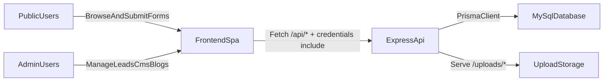

# TechU Product and Development Document

## Purpose

TechU Website is a production lead-generation and content platform with two major surfaces:

- Public marketing website for courses, blog content, and lead capture.
- Admin console for leads operations, CMS section editing, blog publishing, and media uploads.

The system is split into:

- `frontend/`: React + Vite SPA.
- `backend/`: Express API + Prisma + MySQL.

## Product Surfaces

### Public Experience

- Homepage (`/`) built from CMS-managed sections (hero, mentors, webinars, testimonials, contact, footer, popup).
- Courses page (`/courses`) and course detail (`/course-detail?course=...`) with SEO metadata and JSON-LD.
- Blog listing (`/blog`) and blog detail (`/blog/$slug`) with markdown rendering.
- Lead forms for demo, application, and brochure requests.

Primary frontend route files:

- `frontend/src/routes/index.tsx`
- `frontend/src/routes/courses.tsx`
- `frontend/src/routes/course-detail.tsx`
- `frontend/src/routes/blog.index.tsx`
- `frontend/src/routes/blog.$slug.tsx`

### Admin Experience

- Dashboard (`/admin`) with lead stats and trends.
- Leads management (`/admin/leads`) for status/notes/bulk actions.
- CMS editor (`/admin/content`) for site sections.
- Blog manager (`/admin/blogs`) for draft/publish lifecycle.
- Settings (`/admin/settings`) and auth (`/admin/login` redirects to admin shell).

Primary admin route files:

- `frontend/src/routes/admin.index.tsx`
- `frontend/src/routes/admin.leads.tsx`
- `frontend/src/routes/admin.content.tsx`
- `frontend/src/routes/admin.blogs.tsx`
- `frontend/src/routes/admin.settings.tsx`

## System Architecture

## Frontend Architecture

Core characteristics:

- File-based routing with TanStack Router.
- All HTTP calls centralized in `frontend/src/lib/api.ts`.
- Session cookie used automatically (`credentials: "include"`).
- CMS and blog content fetched from backend runtime APIs.
- SEO helper hooks plus JSON-LD for key pages.

Operational frontend contracts:

- `VITE_API_BASE_URL`:
  - Empty string for same-origin (`/api` and `/uploads`).
  - Full origin if API is on a different host.
- `VITE_DEV_API_PROXY` (dev-only) is consumed by Vite proxy config.

## Backend Architecture

Entry and middleware:

- API entrypoint: `backend/src/index.js`.
- Security headers, JSON parsing, cookie parser, CORS allowlist.
- Startup hard checks for production `AUTH_SECRET`.
- Startup DB probe via Prisma (`SELECT 1`).
- Health endpoint at `GET /api/health`.

Mounted domains:

- Auth: `/api/auth/*`
- Leads (public): `/api/leads/*`
- CMS (public): `/api/cms/*`
- Blogs (public): `/api/blogs/*`
- Admin leads: `/api/admin/*`
- Admin CMS: `/api/admin/cms/*`
- Admin blogs: `/api/admin/blogs/*`
- Admin uploads: `/api/admin/uploads/*`
- Uploaded files: `/uploads/*`

Key backend files:

- `backend/src/index.js`
- `backend/src/routes/auth.js`
- `backend/src/routes/leads.js`
- `backend/src/routes/admin.js`
- `backend/src/routes/cms-public.js`
- `backend/src/routes/cms-admin.js`
- `backend/src/routes/blogs-public.js`
- `backend/src/routes/blogs-admin.js`
- `backend/src/routes/uploads.js`
- `backend/src/middleware/auth.js`
- `backend/src/rate-limit.js`

## Data Model (Prisma)

Source of truth: `backend/prisma/schema.prisma`

Core models:

- `User`: admin-authenticated users.
- `UserRole`: role mapping (`admin`, `user`).
- `DemoRequest`: all captured leads with source and status.
- `SiteContent`: JSON blobs per section key for CMS-driven pages.
- `BlogPost`: draft/published posts with tags and publish timestamps.

Enums:

- `Role`: `admin`, `user`
- `DemoSource`: `application`, `brochure`, `demo`
- `DemoStatus`: `new`, `contacted`, `converted`, `archived`

## API Summary

### Public APIs

- `GET /api/health`
- `POST /api/leads/demo`
- `POST /api/leads/application`
- `POST /api/leads/brochure`
- `GET /api/cms/sections`
- `GET /api/cms/sections/:key`
- `GET /api/blogs`
- `GET /api/blogs/:slug`

### Auth APIs

- `POST /api/auth/ensure-admin`
- `POST /api/auth/login`
- `POST /api/auth/logout`
- `GET /api/auth/session`
- `POST /api/auth/change-password`

### Admin APIs

- `GET /api/admin/leads`
- `GET /api/admin/stats`
- `PATCH /api/admin/leads/:id/status`
- `PATCH /api/admin/leads/:id/notes`
- `DELETE /api/admin/leads/:id`
- `POST /api/admin/leads/bulk-status`
- `POST /api/admin/leads/bulk-delete`
- `GET /api/admin/cms/sections`
- `GET /api/admin/cms/sections/:key`
- `PUT /api/admin/cms/sections/:key`
- `GET /api/admin/blogs`
- `GET /api/admin/blogs/:id`
- `POST /api/admin/blogs`
- `PATCH /api/admin/blogs/:id`
- `DELETE /api/admin/blogs/:id`
- `POST /api/admin/uploads/image`

### Internal Debug Endpoint

- `GET /api/test-prisma` (returns sample users; keep restricted at network/proxy level in production if retained).

## Authentication and Session Model

- Session is cookie-based with `iron-session` and server-side secret (`AUTH_SECRET`).
- Login accepts `{ username, password }`, validates, and stores session fields (`userId`, `email`, `isAdmin`).
- Admin access is enforced by middleware (`requireAdmin`) on all admin routers.

## Rate Limiting

Token-bucket per IP in `backend/src/rate-limit.js`:

- `login`: 10/min
- `demo`: 5/min
- `application`: 5/min
- `brochure`: 10/min

## Environment Variables

### Frontend (`frontend/.env*`)

- `VITE_API_BASE_URL`
- `VITE_DEV_API_PROXY` (typically in `.env.local` for local proxy)

### Backend (`backend/.env`)

- Runtime/security: `NODE_ENV`, `AUTH_SECRET`, `PORT`, `HOST`, `CORS_ORIGINS`
- DB connection parts used by app helpers: `DB_HOST`, `DB_PORT`, `DB_NAME`, `DB_USER`, `DB_PASSWORD`
- Admin bootstrap/rotation: `ADMIN_EMAIL`, `ADMIN_PASSWORD`, optional `RESET_ADMIN_PASSWORD`
- Prisma datasource contract: `DATABASE_URL` is required by Prisma schema

Recommended `DATABASE_URL` format:

`mysql://DB_USER:DB_PASSWORD@DB_HOST:DB_PORT/DB_NAME`

## Deployment and Operations

### Required Production Checks

- `AUTH_SECRET` must be set and length >= 32.
- API must pass DB startup probe.
- CORS origins must match deployed frontend origins if cross-origin is used.
- Reverse proxy must route `/api/*` to backend and serve SPA with fallback to `index.html`.
- Upload storage path (`backend/uploads`) must be writable.

### Health and Observability

- Health probe: `GET /api/health`
- Graceful shutdown implemented on `SIGTERM` and `SIGINT`.

### Data and Backup

- Persistent source of truth is MySQL.
- Back up DB regularly and include uploads backup if blog/CMS images are business-critical.

## Production-Critical Workflows

### Lead Capture

1. Public form submits to `/api/leads/*`.
2. Request is validated and rate-limited.
3. Lead is stored in `DemoRequest`.
4. Admin team triages in `/admin/leads` using status and notes.

### Admin Access Bootstrap

1. `/api/auth/ensure-admin` creates or updates admin from env.
2. Admin logs in via `/api/auth/login`.
3. Session cookie powers all admin API access.
4. Post-deploy password should be rotated via UI or env reset flow.

### CMS Publishing

1. Admin edits section JSON via `/admin/content`.
2. API writes to `site_content`.
3. Public pages render updated sections on next fetch.

### Blog Publishing

1. Admin creates/edits post in `/admin/blogs`.
2. Optional cover upload to `/api/admin/uploads/image`.
3. Publish toggle controls visibility on `/blog` and `/blog/:slug`.

## Safe Change Guidelines

- Keep frontend strictly API-only; never add DB clients/secrets in frontend code.
- Preserve `frontend/src/lib/api.ts` as the single network entrypoint.
- Treat Prisma schema updates as migration-required changes.
- Keep admin routes behind `requireAdmin`.
- Validate and rate-limit new public form endpoints.
- Any change to auth/session/env contracts must update docs in this file and `README.md`.

## Known Risk Areas

- Ensure `DATABASE_URL` is always configured where Prisma runs; avoid drift from `DB_*` docs.
- `GET /api/test-prisma` should be reviewed periodically for exposure risk in production.
- Upload disk growth should be monitored if media usage increases.
